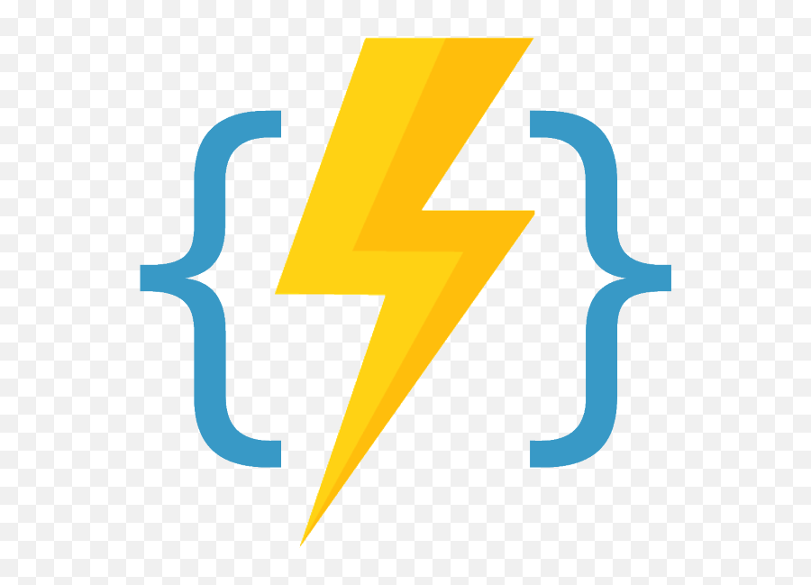

    <h1>Dillan Teagle</h1>
    
    
My best friend is a rubber duck

    
    
    
    

    
    
    
    
    
    
    
    
    
    
    
    
    
    
    
    
    
    

    <h2 align="center">Why do I do what I do?</h2>
     
    <h3 align="center"><a href="https://teaglebuilt.tech">My Website</a>
    <ul>
    <li>
        

        :computer:
            <strong>
                <a href="https://github.com/teaglebuilt/dotfiles">dotfiles</a>
            </strong>
            - Automated provisioning of all my nerdy tools and shortcuts that make up my environment.
        

    </li>
    <li>
        

        :house:
            <strong>
                <a href="https://github.com/teaglebuilt/homelab">Homelab</a>
            </strong>
            - fully provisioned home technology. Collection of home modules that includes gitops kubernetes cluster, dns management, home assistant, smart device management, and the security lab.
        

    </li>
    <li>
        

        :earth_americas:
            <strong>
                <a href="https://github.com/teaglebuilt/web3">Web 3</a>
            </strong>
            - ...loading
    </li>
    </ul>

<!--START_SECTION:waka-->
<!--END_SECTION:waka-->

**Trophies** :trophy:

